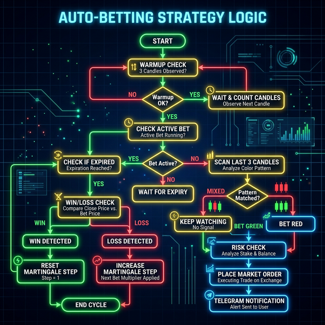

# 🤖 OGBot v1+ — Full Architecture Diagram

---

## 1. System Overview


---

## 2. Auto-Betting Strategy Flowchart



---

## 3. Martingale Betting Systems

| | 🛡️ SAFE (Linear) | 🚀 HIGH PROFIT (Triple) |
|---|---|---|
| Step 1 | $1 | $1 |
| Step 2 | $2 | $3 |
| Step 3 | $3 | $9 |
| Step 4 | $4 | $27 |
| Step 5 | $5 | $81 |
| **WIN** | Reset → Step 1 ✅ | Reset → Step 1 ✅ |
| **LOSS** | Next Step ❌ | Next Step ❌ |

---

## 4. Thread Architecture

| Thread | Function | Interval | What it Does |
|--------|----------|----------|-------------|
| Thread 1 | `fetch_live_price()` | 0.1s | Binance BTC live price |
| Thread 2 | `fetch_market_data("5m")` | 15s | 5m candles + Polymarket tokens |
| Thread 3 | `fetch_market_data("15m")` | 15s | 15m candles + Polymarket tokens |
| Thread 4 | `input_thread_func()` | Blocking | Terminal CLI commands |
| Thread 5 | `run_telegram_bot()` | Polling | Telegram UI & callbacks |
| **Main** | `process_cycle()` | 5s | Strategy processing + Auto redeem |

---

## 5. File Responsibilities

| File | Role | Key Functions |
|------|------|--------------|
| `main.py` | Entry point, thread manager | `fetch_live_price()`, `fetch_market_data()` |
| `mode_controller.py` | Brain — orchestrates everything | `process_cycle()`, `set_mode()`, `toggle_auto_redeem()` |
| `strategy_5m.py` | 5-minute auto-betting logic | `process()`, `get_current_bet_amount()` |
| `strategy_15m.py` | 15-minute auto-betting logic | `process()`, `get_candle_sequence_display()` |
| `execution.py` | Trade engine + cashout | `place_market_order()`, `redeem_all_funds()` |
| `telegram_bot.py` | Telegram UI | `run_telegram_bot()`, `send_telegram_notification()` |
| `dashboard.py` | Terminal Rich UI | `generate_layout()`, market panels |
| `risk_manager.py` | Bet validation | `validate_bet()` |
| `fund_transfer.py` | USDC transfers | `transfer_usdc()` |
| `config.py` | Settings loader | Reads `.env` |

---

## 6. Data Flow

```
Binance API ──(candles)──► main.py ──► ModeController.data_5m/data_15m
                                            │
                                     process_cycle() (every 5s)
                                            │
                              ┌──────────────┴──────────────┐
                              ▼                              ▼
                        Strategy5M                    Strategy15M
                              │                              │
                    Check Warmup (3 candles)       Check Warmup (3 candles)
                    Check Active Bet               Check Active Bet
                    Scan Last 3 Candles            Scan Last 3 Candles
                              │                              │
                    🔴🔴🔴 = Bet GREEN             🟢🟢🟢 = Bet RED
                              │                              │
                              └──────────┬───────────────────┘
                                         ▼
                              execution.place_market_order()
                                         │
                              Polymarket CLOB API (FOK order)
                                         │
                              📱 Telegram Notification
```

---

## 7. Telegram Menu Tree

```
🏠 Home Dashboard
├── ▶️ START / ⏸ STOP Bot
├── 🛡️ SAFE Mode (1,2,3)
├── 🚀 HIGH PROFIT (1,3,9)
├── 💰 Cashout Now
├── 🤖 Auto Cash: ON/OFF
├── 📈 Trade 5m
│   ├── 🟩 BUY UP
│   ├── SELL UP
│   ├── BUY DOWN
│   ├── SELL DOWN
│   └── 🎯 Custom Limit
├── 📉 Trade 15m (same as 5m)
├── 💸 Withdraw $
│   ├── Enter Address
│   └── Enter Amount → Send USDC
├── ⚙️ More Settings
│   ├── 💰 Set Base Bet
│   ├── 🕒 Market Mode (5m/15m/Both)
│   └── 📊 Detailed Status
└── 🔄 Refresh Dashboard
```

---

## 8. Environment Variables

| Variable | Required | Description |
|----------|----------|-------------|
| `PRIVATE_KEY` | ✅ | Polygon wallet private key |
| `POLY_FUNDER` | ❌ | Polymarket funder address |
| `TELEGRAM_BOT_TOKEN` | ✅ | Telegram bot API token |
| `ALLOWED_CHAT_ID` | ✅ | Authorized Telegram chat ID |
| `RPC_URL` | ❌ | Custom Polygon RPC (default: polygon-rpc.com) |
| `BOT_MODE` | ❌ | Startup mode: `MANUAL` or `AUTO` |
| `DRY_RUN` | ❌ | `True` for simulation mode |
